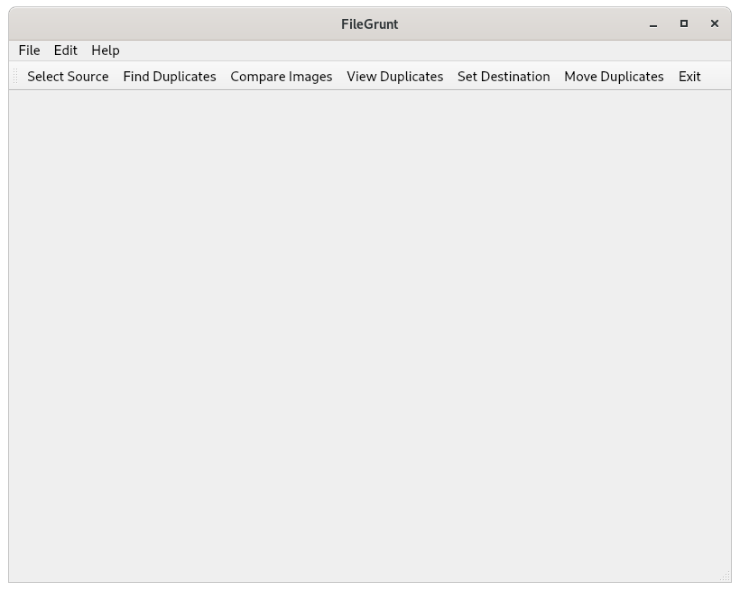

# FileGrunt v0.0.0

Utility to identify duplicate files/images and allow the user to move the duplicates to a location for backup or deletion.

This project is under development and is being used to help learn C++, OpenCV and cross platform development. Also being used to learn
how to setup and structure an Open Source Project.

Please check our [issues](https://github.com/filegrunt/filegrunt/issues) list to see how you can help out.

# Development
CLION IDE on Debian Bullseye and Gnome Desktop as Development Environment

QT Framework 6.2.2, OpenCV 4.5.5 , SQLite 3 and C++ 

sqlite Browser to view sqlite database https://github.com/sqlitebrowser/sqlitebrowser 

Aiming for a cross platform utility that will work on Linux, Mac & Windows.

# How it works Now

- Performs like a snail when lots of files being processed, expected as much as it's using local database rather than in memory. This helps to troubleshoot.

1. Select a source folder
2. List of media files added to sqlite database
3. Duplicates identified by comparing file name and file size
4. Duplicate image files are then compared to each other using OpenCV bitwise XOR which results in all zeros if images match
5. The duplicates are recorded in the sqlite database
6. The destination directory for the duplicate files can be selected
7. The duplicate files can be "moved" - copied for testing to the destination directory.

# TODO
- Create a FileGrunt Logo - without this nothing will work!
- Allow visual inspection of original and duplicates
- Decide on which one should be classed as a duplicate e.g. earliest date?
- Remove the duplicates from the source
- Allow use of in memory database as an alternative to offline database
- Combine Find Duplicates, Compare Images and View Duplicates into one process that displays images after duplicates found
- Move Set destination step to start of process
- Improve README.md file.
- Setup Gitlab for CI/CD 
- Figure out how to create a cross platform executable/installation package.
- Create a Wiki/Issues list and tidy up this file :-)

## Snap packages

#### Snap Nightlies

     snap install filegrunt --edge --devmode

#### To Remove

    sudo snap remove filegrunt

#### Snap Stable

     working on it :-)

# Working Prototype

# Does it Work
Yes on Linux, allows you to select a source and destination directory and copy the duplicate files it finds.

# Compiling
Instructions for compiling on Windows, macOS, Linux, and FreeBSD are in [BUILDING](BUILDING.md).

# Testing
Plan is to use GitHub Actions
https://www.incredibuild.com/blog/using-github-actions-with-your-c-project

# Contributing
Check out our contribution guidelines here [CONTRIBUTING](./docs/CONTRIBUTING.md)

# Useful Links
- Markdown Cheat Sheet for README.md https://www.markdownguide.org/cheat-sheet/
- Open Source Guide https://opensource.guide/
- https://www.freelogodesign.org/
- https://www.sqlite.org/
- Snapcraft Demo https://youtu.be/BEp_l2oUcD8
- First Snap https://medium.com/geekculture/how-i-made-my-first-snap-470d22eb621a
